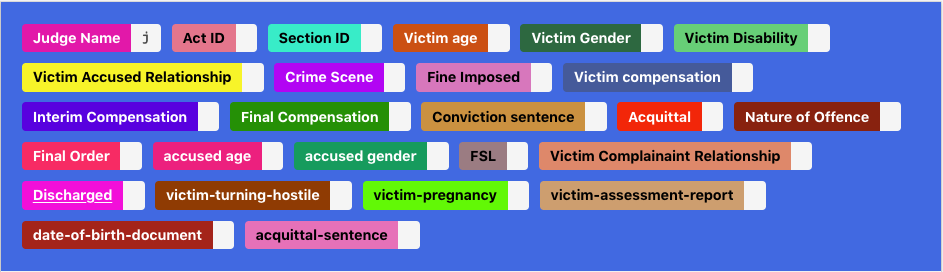
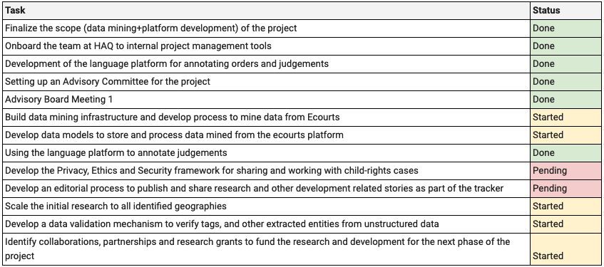

```{r setup, include=FALSE}
knitr::opts_chunk$set(echo = FALSE)
```

# A few updates (Jan/Feb, 2020)

## Overview

- Developing the annotation platform for tagging judgements
- Finalise the list of variables to be identified from Judgements
- Fetching data for POCSO cases from eCourts
- Building the frames for data analysis
- Partner Collaborations

# Judgement Annotation | Process, Progress and Challenges

## Processes

- The process was initiated by annotating judgements from the district courts of **Delhi**
- The first batch included 63 judgements. 
- This was a _random sample_ of judgements that included cases of both acquittal conviction, the former being the larger chunk

## Tags

- A total of **26** variables were identifed to be tagged in judgements



- [Judgement Annotation Platform](cheyyali.samantar.in/)
  - Developed using an open source tool - **Doccano** [[Link](https://doccano.herokuapp.com/)] | [[Project on Github](https://github.com/doccano/doccano)]

## Progress

- The annotation process for the first batch was completed over a period of **5 weeks**
- Overall, we observed, some variables like `Judge Name`, `Act ID`, `Section ID`, etc.. are easier to identify, but variables like `Crime Scene`, `Victim Age`, `Victim Gender` are very diverse in terms of reporting, and we shall require more judgements from different courts to identify patterns, if any. 
- `Victim Disability` will be identified through specific words. Details [here](https://taiga.civicdatalab.in/project/apoorv-law-implementation-tracker-haq/us/127).

## Contd .. 

- Few rule based variables:
  - `Victim Gender` - Identify `prosecutrix` - these are cases with a female victim
  - `Fine Imposed` - Presence of certain sections related to the POCSO act
- We could not find enough judgements to identify reporting patterns for variables such as `FSL`, `Discharged`, `victim-pregnancy`, `Victim Accussed Relationship`

## List of variables | Current Status and Next Steps

* [Annotation Report](https://docs.google.com/spreadsheets/d/17sUJesPPSEixiCTjHAAiKVes-L075yFfoniWCWSbGro/edit#gid=1041097091)

```{r echo=FALSE, message=FALSE, warning=FALSE, paged.print=FALSE}
# library(DT)
# judgement_annotation_report <- read.csv('../docs/judgement_annotation _report_phase1.csv', check.names = FALSE)
# DT::datatable(judgement_annotation_report)
```


## Challenges

- Finding a good sample for judgement annotation across districts 
- We have a few variables such as `Fine Imposed`, `Victim Compensation`, etc that are mostly present in cases of conviction, hence a good diverse sample is required
- Victim `Gender` and `Age` variables are hard to extract.
- Some variables like `Disability`, `Pregnancy` and `Crime Scene` are a too generic and we may need to reduce their scope a bit. 
   - For Eg: instead of talking about crime scene, we can find cases that happened in a school, college, neighbourhood, etc.

## Next Steps on Judgement Annotation

- Annotating judgements for remaining states
- Scaling initial research to all district courts from Delhi
- Setting up processes to validate the variables identified through the annotation process 

# Data Mining | Process, Progress and Challenges

## Process- Fetching data from eCourts

- Metadata (All variables for a case - as is) [List](https://github.com/HAQ-Centre-for-Child-Rights/POCSO-law-implementation-tracker/blob/master/docs/Delhi/data-dictionary.md)
- All orders and judgements
- [Project Repository](https://gitlab.civicdatalab.in/civicdatalab/ecourts-etl-pipeline/)

## Progress

- [Data Report](https://github.com/HAQ-Centre-for-Child-Rights/POCSO-law-implementation-tracker/blob/master/data/Delhi/data-report.csv)


## The frames of analysis

- [Link to document](https://docs.google.com/document/d/1EuypwV2HS8IXTKStaaBolInxQ2f1DrXOXVFhMspg58k/edit?usp=sharing)

# Partner Collaborations

## Swagata Raha

* Has agreed to offer her time and expertise for legal research and data analysis. 
* She led a few studies in Delhi, Assam and Maharashtra on the Implementation of the POCSO Act by Special Courts as part of the Centre for Child and the Law, NLSIU Bangalore. 
* All reports for the study are shared on the [drive](https://drive.google.com/drive/folders/14gQv-H1GIzz8kaf_pYqin0P9e7izj_1O)

## The Engine Room

- They're supporting us on dealing with reporting of sensitive datasets and finding ways to safely navigate using and sharing data on child sexual abuse. 
- Will also help us develop a responsible data handling and sharing policy for the project. 
- [Responsible Data forum](https://responsibledata.io/)

## Next Steps (March/April, 2020)

- Start working towards the research and analysis part
- Develop a robust data processing and validation process and 
- Building a data platform to host datasets and analysis. 

# Project Health

## Project Status (As per the project plan)

Plan till **March, 2020**



```{r echo=FALSE, message=FALSE, warning=FALSE, paged.print=FALSE}
# library(kableExtra)
# library(knitr)
# library(dplyr)
# project_status <- read.csv("../docs/project-status.csv")
# project_status %>% mutate(Status = cell_spec(Status, "html", color = ifelse(Status == "Pending", "red", ifelse(Status == 'Started', "orange", ifelse(Status =='Done', "green", "black"))))) %>%
# kable(format = "html", escape = F) %>%
# kable_styling("striped", full_width = F)
```

- [Statement of Work](https://docs.google.com/document/d/19PwHuIX2Fk03u_gaScUKdY1HqV6zoa8cuZzI7QhuMS8/edit?usp=sharing)

## Funding Status

- On discussion with Nilekani Philanthrophies
- Other grants